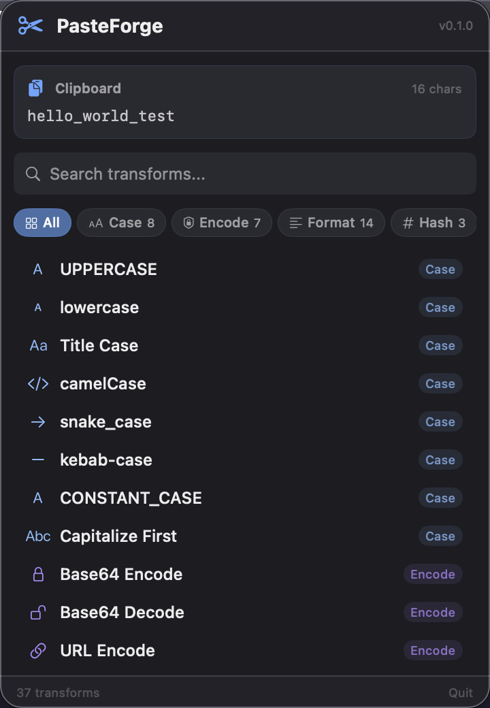

# PasteForge

**Transform your clipboard text from the menu bar.** Copy text, pick a transform, paste the result. No terminal, no web tools, no context switch.



## Why it exists

You copy text constantly — variable names, API responses, URLs, code snippets. Half the time you need it transformed: uppercased, base64-encoded, JSON-formatted, hashed. Today you open a terminal, a web tool, or an editor. PasteForge puts 35+ transforms one click away in your menu bar.

## Install

```bash
# Clone and build
cd PasteForge
chmod +x build.sh
./build.sh

# Launch
open PasteForge.app
```

Or compile directly:
```bash
swiftc -parse-as-library -o PasteForge PasteForge.swift
./PasteForge
```

## Quickstart

1. Copy any text (Cmd+C)
2. Click the scissors icon in your menu bar
3. See your clipboard text preview at the top
4. Click any transform — result appears instantly
5. Click "Copy to Clipboard" (or the result auto-replaces your clipboard)
6. Paste (Cmd+V) wherever you need it

## Transforms (37 total)

### Case (8)
UPPERCASE, lowercase, Title Case, camelCase, snake_case, kebab-case, CONSTANT_CASE, Capitalize First

### Encode/Decode (7)
Base64 Encode/Decode, URL Encode/Decode, HTML Encode/Decode, Unicode Escape

### Format (14)
JSON Pretty/Minify, Sort Lines, Unique Lines, Reverse Lines, Reverse Text, Trim Whitespace, Remove Blank Lines, Add Line Numbers, Remove Duplicates, Wrap in Quotes, Extract URLs, Extract Emails, Strip HTML

### Hash (3)
MD5, SHA-1, SHA-256

### Stats (5)
Character Count, Word Count, Line Count, Byte Size, Reading Time

## Examples

**API key as Base64 for auth headers:**
Copy `sk-abc123`, click Base64 Encode → `c2stYWJjMTIz`

**Snake case to camelCase:**
Copy `user_first_name`, click camelCase → `userFirstName`

**Pretty-print API response:**
Copy `{"name":"test","id":1}`, click JSON Pretty → formatted JSON

**Verify file hash:**
Copy file contents, click SHA-256 → hash string

**Clean up messy text:**
Copy text with extra whitespace, click Trim Whitespace → clean text

## Features

- Dark theme matching macOS style
- Search/filter transforms by name
- Category filter chips (All, Case, Encode, Format, Hash, Stats)
- Clipboard auto-detection (polls every 1s)
- Green dot indicator when clipboard has text
- Result preview with character count
- One-click copy to clipboard
- Empty state when clipboard is empty
- No dock icon (menu bar only)

## Troubleshooting

**App doesn't appear in menu bar:**
Make sure you're running the `.app` bundle or the compiled binary, not `swift PasteForge.swift` (which won't work with `@main`).

**"No text on clipboard" when you've copied something:**
PasteForge only reads text from the clipboard. Images, files, and other non-text content won't be detected.

**Transforms show "[Invalid JSON]" or "[Invalid Base64]":**
The input text isn't valid for that transform. This is expected behavior — the error message tells you what's wrong.

## Requirements

- macOS 14+
- Swift 6.0+

## License

MIT
